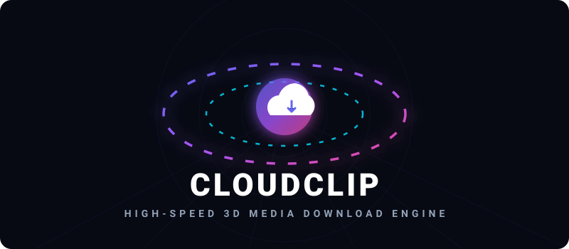

<p align="center">
  
</p>

<p align="center">
  
</p>

---

## 🚀 Key Features

*   **💎 Premium UI & Design**: Built with a curating Light Theme as default, featuring smooth 3D parallax hover cards, high-contrast layouts, and floating background composition auras.
*   **👨‍💻 Developer Integration Modal**: Seamlessly integrated profile information modal showcasing developer details (Name, Email, LinkedIn, and GitHub) accessible directly from the header actions.
*   **⚡ Node-Powered YouTube Signature Bypass**: Integrated with specific `node` JS-runtimes and remote components directly solving complex YouTube challenge checks.
*   **🛠️ Background Stream Merging (Muxer)**: Initiates separate high-definition video and audio streaming queues, merging them on-the-fly using background child processes.
*   **🔒 Security & Privacy-First**: Includes automatic backend temp folder sweepers running every 10 minutes, rate limiting, and parameter verification.
*   **⚙️ Custom User Configs**: Retains default download parameters, history logs, and language selections inside the local storage cache.

---

## 📂 Project Structure

```
CloudClip/
├── client/                 # React frontend (Vite environment)
│   ├── src/
│   │   ├── components/     # Layout buttons & components
│   │   ├── context/        # ThemeContext controller
│   │   ├── pages/          # Downloader core rendering
│   │   └── index.css       # Layout styles & 3D variables
│
├── server/                 # Express API backend
│   ├── src/
│   │   ├── config/         # Environment variables loaders
│   │   ├── middleware/     # Rate limiter & security hooks
│   │   ├── routes/         # Express endpoint maps
│   │   └── services/       # ytDlp wrappers & jobs controllers
│
├── shared/                 # Config constants shared between modules
└── tests/                  # Backend unit & integration test coverage
```

---

## 🛠️ Installation & Setup

### Prerequisites
1.  **Node.js** (v18.0.0 or higher)
2.  **FFmpeg** (registered in system environment PATH variables)
3.  **yt-dlp** (registered in system environment PATH variables)

### Launch Steps
1.  **Install dependencies**:
    ```bash
    npm run setup
    ```
2.  **Add Configuration**:
    Create a local environment file at `server/.env`:
    ```env
    PORT=5000
    NODE_ENV=development
    CLIENT_URL=http://localhost:5173
    DOWNLOAD_DIR=downloads/temp
    CLEANUP_INTERVAL_MS=300000
    FILE_LIFETIME_MS=600000
    RATE_LIMIT_MAX=100
    ```
3.  **Run Dev Servers**:
    ```bash
    npm run dev
    ```
    - Access Frontend at: [http://localhost:5173](http://localhost:5173)
    - Access Backend API at: [http://localhost:5000](http://localhost:5000)

---

## 📡 API Reference

| Endpoint | Method | Payload | Purpose |
| :--- | :--- | :--- | :--- |
| `/api/metadata` | `POST` | `{ "url": "..." }` | Extracts links, formats, and thumbnails |
| `/api/download/prepare` | `POST` | `{ "url": "...", "formatId": "...", "type": "video\|audio", "title": "..." }` | Registers a background download job |
| `/api/download/status/:jobId` | `GET` | *None* | Polls active download and merge progress |
| `/api/download/file/:jobId` | `GET` | *None* | Downloads completed file and triggers automated server cleanup |
| `/api/download/cancel/:jobId` | `POST` | *None* | Kills active processes and sweeps temporary chunks |

---

## 👨‍💻 Developed By

<div align="center">

  ### **Ashish Goswami**
  *Flutter & Fullstack Developer*

  > "Turning complex backend logic and wireframes into elegant, high-performance digital experiences." 🚀

  <table align="center">
    <tr>
      <td align="center" style="border: none;">
        <a href="mailto:ashishgoswami6298@gmail.com">
          
        </a>
      </td>
      <td align="center" style="border: none;">
        <a href="https://github.com/Ashish6298">
          
        </a>
      </td>
    </tr>
    <tr>
      <td align="center" style="border: none;">
        <a href="https://www.linkedin.com/in/ashish-goswami-58797a24a/">
          
        </a>
      </td>
      <td align="center" style="border: none;">
        <a href="https://github.com/Ashish6298">
          
        </a>
      </td>
    </tr>
  </table>
</div>

